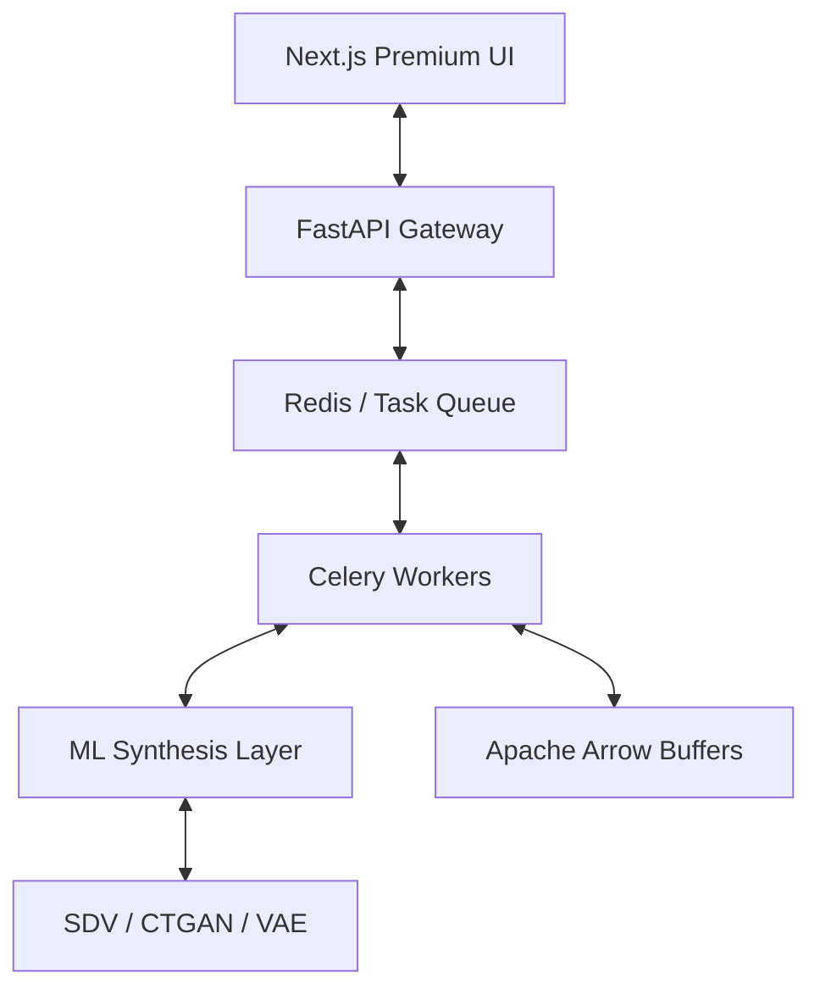

# BurstDB Synthesis Systems

**BurstDB** is a high-performance generative data synthesis platform designed for the modern enterprise. It transforms architectural metadata into high-fidelity synthetic databases, enabling seamless development and testing without production data risk.

---

## 🏗️ Technical Architecture

BurstDB operates on a distributed synthesis model, separating the orchestration gateway from the heavy-lift machine learning modeling cluster.

### Core Components

#### 1. Synthesis Command Center (UI)
A specialized visual studio for blueprint modeling and real-time generation orchestration. Built with Next.js 15, it manages a high-complexity **Zustand** state machine for referential integrity checking on the client side.

#### 2. Synthesis Gateway (API)
An asynchronous FastAPI service that acts as the orchestration brain. It implements a **ConstraintGraph** logic to ingest SQL, NoSQL, and Graph schemas and convert them into a unified, model-ready synthesis manifest.

#### 3. Distributed Worker Cluster (ML)
Scalable Celery nodes that execute the actual generative modeling.
- **Data Plane**: Uses **Apache Arrow** for high-speed, zero-copy serialization between the ML models and the output buffers.
- **Modeling Stratagem**: Leverages the **SDV ecosystem** (CTGAN, HMA, Gaussian Copulas) for specialized data reconstruction.

#### 4. Quality Audit Engine
Integrated statistical validation layer that performs **KS-Tests** and **TVD (Total Variation Distance)** calculations to ensure synthetic data fidelity mirrors production distributions with over 90% accuracy.

---

## 🔒 Security & Data Sovereignty

Engineered for the most stringent compliance environments:
- **Differential Privacy (ε-DP)**: Mathematical noise injection to prevent production data leakage.
- **Local-First Processing**: All synthesis happens entirely within your VPC; no raw data is ever transmitted to external AI services.
- **PII Shield**: Automatic Named Entity Recognition (NER) to identify and synthesize sensitive identifiers recursively.

---

## 🌐 Next Steps

- [Getting Started](/docs/getting-started) — Infrastructure setup and orchestration
- [Synthesis Terminal](/docs/dashboard) — Monitor your distributed cluster
- [API Reference](/docs/api-reference) — Precision integration specs

